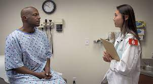

# NLP-Medical Record-CapstoneProject

Here we will use natural language processing in order to identify medical condition listed in patient history notes.

---

## Authors

- [@christian_freeman](https://github.com/cfreeman22)
- [@jared_godar](https://github.com/Jared-Godar)
- [@scott_schmidl](https://github.com/scottschmidl)
- [@brent_schriver](https://github.com/brentschriver)

---

## About the Project

Writing patient notes to document the history of a patient's complaint, exam findings, possible diagnoses, and care. Learning and assessing these skills requires feedback from other doctors. 

Until recently, a part of clinical skills exams for medical students involved interacting with standardized patients and taking notes. These notes were later scored by trained physician raters in a labor intensive process.

This project seeks to use natural language processing to identify specific clinical concepts in patient nots.

---

## Project Goals

- Develop automated method to map clinical concepts from an exam ruberic to various ways in which these concepts are expressed in clinical patient notes written by medical students.

**DELIVERABLES:**

- [ ] A well-documented [Jupyter notebook](https:/link) that contains a report of your analysis, and link to that notebook.
- [ ] A [slideshow](https://dlink) suitable for a general audience that summarizes your findings.
- Include well-labeled visualizations in your slides.
- [x] Link to the [team Trello board.](https://trello.com/b/2DbGhUdS/nbme-score-clinical-patient-notes)
- [ ] A presentation. Each team member should present a portion of the presentation.

---

## Initial Questions

1. What clinical conditions are present for the 10 standardized patients?
2. On average, how many conditions do students correctly label?
3. What words or phrases are tied to specific patients and conditions?
4. How do we predict multiple outcomes in a multiclass classification process?
5. What other NLP libraries could be useful besides NLTK? (Spacey)
6. What other pre-trained medical NLP models would be good? (i.e., BioBERT)
7. What deep learning approaches would be appropriate to solving these questions?

---

## Initial Hypotheses

1. There will be patient and condition specific words from notes corresponding to the target conditions.
2. Bigrams and higher order n-grams could be good modeling features.

---

## Data Dictionary

| Feature                 | Datatype                         | Definition                                                 |
|:------------------------|:---------------------------------|:-----------------------------------------------------------|
|               |             |            |
|               |             |            |
|               |             |            |

---

## Steps to Reproduce

- [x] Read the `README.md`.
- [ ] Clone this repository to your local environment.
  - [ ] `git clone git@github.com:codeup-nlp-capstone/nlp-capstone.git`
- [ ] Open the `conda_env.yml` file and follow the instructions to create an environment with the proper libraries.
- [ ] Download the `csv` files from the [kaggle website](https://www.kaggle.com/c/nbme-score-clinical-patient-notes/data) and ensure they are in your repository directory.
  - [ ] `features.csv`
  - [ ] `patient_notes.csv`
  - [ ] `test.csv`
  - [ ] `train.csv`
- [ ] Run final report notebook.

---

## Plan

1. **Acquire Data**
   1. Download from kaggle.
2. **Prepare Data** Use the NLTK to:
   1. Convert text to lower case.
   2. Remove any accented, non-ASCII characters.
   3. Remove any special characters.
   4. Lemmatize words.
   5. Remove stopwords
   6. Produce a dataframe with the original and cleaned text.
   7. Split data:
      1. Train, validate, test.
      2. Separate x/y features / target (language).
3. **Explore**
   1. Look at the languages represented.
   2. Separate the overall corpus into word lists for each language patient and each condition.
   3. Look at the frequency of words in each list to determine unique words or words with high predictive value.
   4. Visualize most frequent words by patient.
   5. Examine bigrams and other n-grams.
4. **Model:**
   *MVP* will be a multiclass, multioutput classification assigning conditions to notes using NLTK and MLP methods from the curriculum.
   1. Feature enginnering
      1. Determine Term Frequency(TF).
      2. Determine Inverse Document Frequency(IDF).
      3. Calculate the TF-IDF index.
   2. Build models
      1. Logistic regression
      2. Decision trees
      3. Random Forest
      4. KNN
   3. Tune models
      1. Use the train and validate datasets to check for overtraining.
      2. Perform k-fold cross-validation.
   4. Evaluate models
      1. Determine the most important evaluation metric.
      2. Compare confusion matrices of different models to see which performs best.
      3. Test the best model on out of sample data.
   *Deep Learning models* RNN, LSTM, other neural network approaches to classification.
5. **Delivery**
   1. Refine best visuals.
   2. Create slides.
   3. Divide presentation.
   4. Rehearse.
   5. Deliver

---

## Key Findings

- 

---

## Conclusions

- 

---

## Future Directions

- 

---

# Thank you for your time and attention