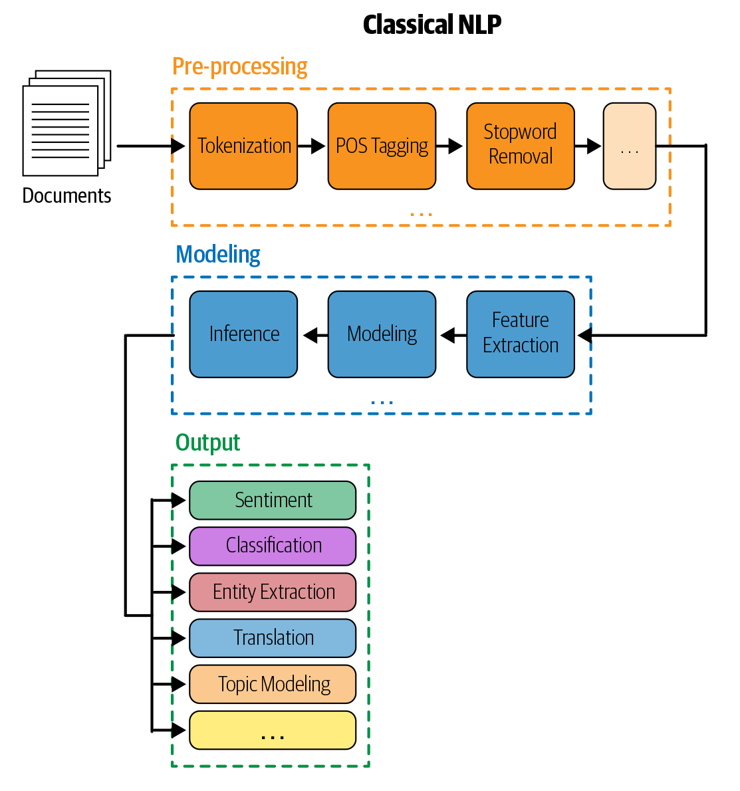
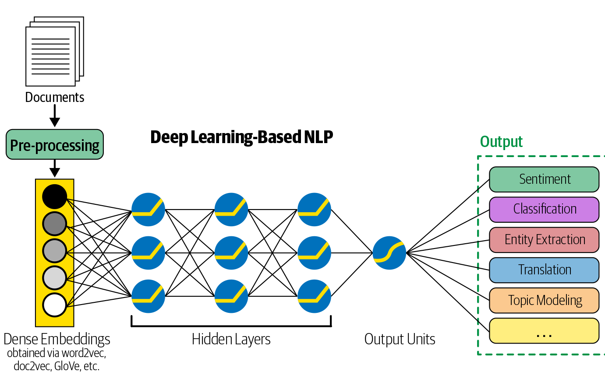

# NLP-Medical Record-CapstoneProject

Here we will use natural language processing in order to identify medical condition listed in patient history notes.

---

## Authors

- [@christian_freeman](https://github.com/cfreeman22)
- [@jared_godar](https://github.com/Jared-Godar)
- [@scott_schmidl](https://github.com/scottschmidl)
- [@brent_schriver](https://github.com/brentschriver)

---

## About the Project

Writing patient notes to document the history of a patient's complaint, exam findings, possible diagnoses, and care. Learning and assessing these skills requires feedback from other doctors.

Until recently, a part of clinical skills exams for medical students involved interacting with standardized patients and taking notes. These notes were later scored by trained physician raters in a labor intensive process.

This project seeks to use natural language processing to identify specific clinical concepts in patient nots.

---

## Project Goals

- Develop automated method to map clinical concepts from an exam ruberic to various ways in which these concepts are expressed in clinical patient notes written by medical students.

**DELIVERABLES:**

- [ ] A well-documented [Jupyter notebook](https:/link) that contains a report of your analysis, and link to that notebook.
- [ ] A [slideshow](https://dlink) suitable for a general audience that summarizes your findings.
- Include well-labeled visualizations in your slides.
- [x] Link to the [team Trello board.](https://trello.com/b/2DbGhUdS/nbme-score-clinical-patient-notes)
- [ ] A presentation. Each team member should present a portion of the presentation.

---

## Initial Questions

1. What clinical conditions are present for the 10 standardized patients?
2. On average, how many conditions do students correctly label?
3. What words or phrases are tied to specific patients and conditions?
4. How do we predict multiple outcomes in a multiclass classification process?
5. What other NLP libraries could be useful besides NLTK? (Spacey)
6. What other pre-trained medical NLP models would be good? (i.e., BioBERT)
7. What deep learning approaches would be appropriate to solving these questions?

---

## Initial Hypotheses

1. There will be patient and condition specific words from notes corresponding to the target conditions.
2. Bigrams and higher order n-grams could be good modeling features.

---

## Data Dictionary

| Feature                 | Datatype         | Definition                                                                       |
|:------------------------|:-----------------|:---------------------------------------------------------------------------------|
|  pn_num                 |  int             |  A unique identifier for each patient notes                                      |
|  case_num               |  int             |  A unique identifier for the clinical case a patient note represent              |
|  pn_history             |  String          |  The text of the encounter as recorded by the test taker.                        |
|  feature_num            |  int             |  A unique identifier for each feature.                                           |
|  feature_text           |  String          |  A description of the feature                                                    |
|  Id                     |   int            |  A unique identifier identifier for each patient note / feature pair.            |
|  Annotation             |  String          |  The text within the patient’s note indicating a feature                         |
|  Location               |   Int            |  The character spans indicating the location of each annotations within the notes|
|  Original               |  String          |  The raw text as recorded by the test taker.                                     |
|  clean                  |  String          |  The cleanned version of the raw text tokenized, with stoword removed.           |
|  stemmed                |  String          |  reducing inflection in words to their root forms                                |
|  lemmatized             |  String          |  considers the context and converts the word to its meaningful base form         |

---

## Steps to Reproduce

- [x] Read the `README.md`.
- [ ] Clone this repository to your local environment.
  - [ ] `git clone git@github.com:codeup-nlp-capstone/nlp-capstone.git`
- [ ] Open the `conda_env.yml` file and follow the instructions to create an environment with the proper libraries.
- [ ] Download the `csv` files from the [kaggle website](https://www.kaggle.com/c/nbme-score-clinical-patient-notes/data) and ensure they are in your repository directory.
  - [ ] `features.csv`
  - [ ] `patient_notes.csv`
  - [ ] `test.csv`
  - [ ] `train.csv`
- [ ] Run [final report notebook](https://github.com/codeup-nlp-capstone/nlp-capstone/blob/main/mvp-presentation-notebook.ipynb).

---

## Plan

---

### Classical Modeling approach

1. **Acquire Data**
   1. Download from kaggle.
2. **Prepare Data** Use the NLTK to:
   1. Convert text to lower case.
   2. Remove any accented, non-ASCII characters.
   3. Remove any special characters.
   4. Lemmatize words.
   5. Remove stopwords
   6. Produce a dataframe with the original and cleaned text.
   7. Split data:
      1. Train (700), test(300).
         1. We will use k-fold cross validation in lieu of having another out-of-sample split.
      2. Separate x/y features / target (clinical feature).
3. **Explore**
   1. Look at the clinical features represented.
   2. Separate the overall corpus into word lists for each patient and each clinical feature.
   3. Look at the frequency of words in each list to determine unique words or words with high predictive value.
   4. Visualize most frequent words by patient.
   5. Examine bigrams and other n-grams.
4. **Model:**
   *MVP* will be a model determining the case number from the patient note
   1. Feature enginnering
      1. Determine Term Frequency(TF).
      2. Determine Inverse Document Frequency(IDF).
      3. Calculate the TF-IDF index.
   2. Build models
      1. Logistic regression
      2. Decision trees
      3. Random Forest
      4. KNN
   3. Tune models
      1. Use k-fold cross validation to  check for overtraining.
   4. Evaluate models
      1. Figure out the baseline.
      2. Determine the most important evaluation metric.
      3. Compare confusion matrices of different models to see which performs best.
      4. Test the best model on out of sample data.
   *Deep Learning models* RNN, LSTM, other neural network approaches to classification.

### Additional Classical Models

1. Attempt to label feature from the training data notes.
2. Make a separate model for each condition, limiting the number of features.
3. Find a way to get multiple classificatuon outputs of models.
4. Look into feature extraction using classical approaches.
5. Look into model improvement through *model stacking* or *model ensembling*.

---

### Deep Leanting Approach

1. Set up Environment for SciSpacy
2. Shortfalls with word count vectorzation:
   1. i.e., Patient denies pain, shortness of breath, etc., etc., ... Long list of things that they **DON'T** have.
   2. Need context-dependent word embedding
3. Look into Gensym word embedding
4. Use SpaCy and specifically, SciSpacy for parts of speech tagging looking to identify conditions, drugs, and other relavant features.
5. Consider training a different model for each case/
6. Look at LSTM and multilable, multiclass.

### Delivery

1. Refine best visuals.
2. Create slides.
3. Divide presentation.
4. Rehearse.
5. Deliver

## Key Findings

- Classical models perform well on simple tasks like assigning which of the ten possible cases the note belongs to based on the content of the note.
- These approaches fail at more complex tasks like extracting the 143 different clinical concepts from the notes
- Concepts can be expressed in many different ways with many different words
- Spelling is inconsistent in these notes with many misspellings
- TF-IDF and other word-count based approaches are insufficient
- More sophisticated methods for word embedding that capture context are needed
  - SpaCy
  - SciSpaCy
  - BioBERT
- Each of these additional deep-learning approaches add new, useful information, but none of them alone solve the problem of extracting and identifying clinical concepts from patient notes
- Our final model will likely be an ensemble of different models employing these techniques.

---

## Conclusions

- Classical techniques with word counts can be used to accurately predict simple classifications.
- These techniques are insufficient for identifying clinical concepts in notes because there are so many different ways to express the same concept in words.
- Deep learning approaches that look at word context improve models.
- Some of those approaches have been trained specifically on biomedical data and those perform best.

---

## Future Directions

- Add BioBERT.
- Use different word embeddings for deep learning models using LSTMs.
- Create ensemble models incorporating these different embeddings.

---

## Thank you for your time and attention